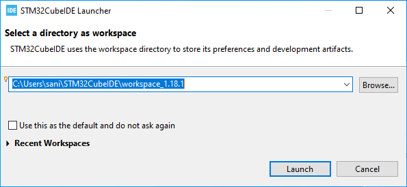
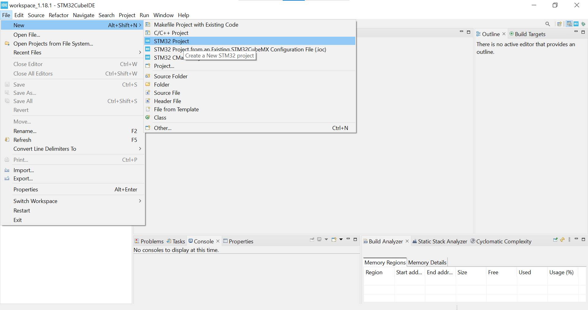
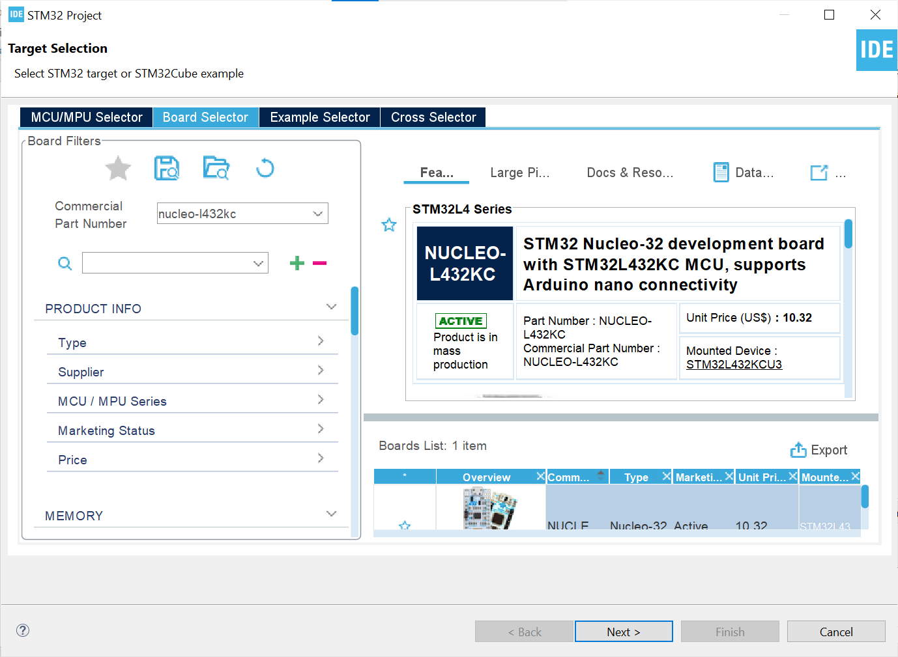
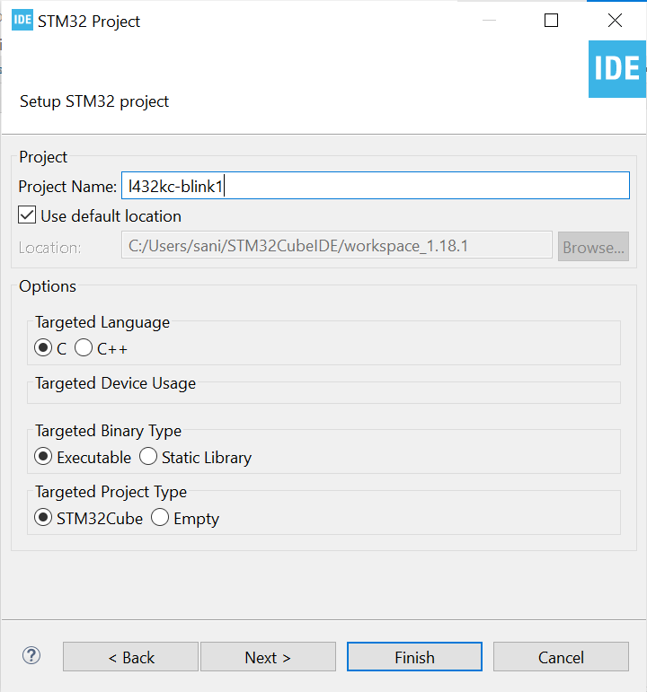
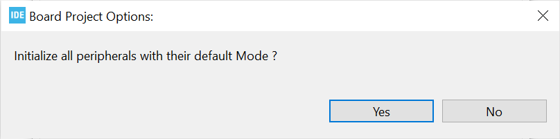
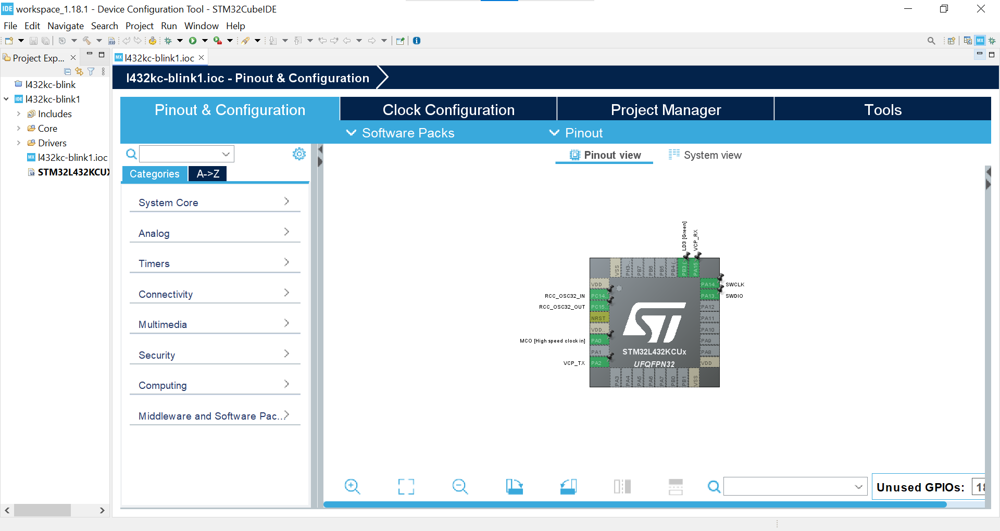
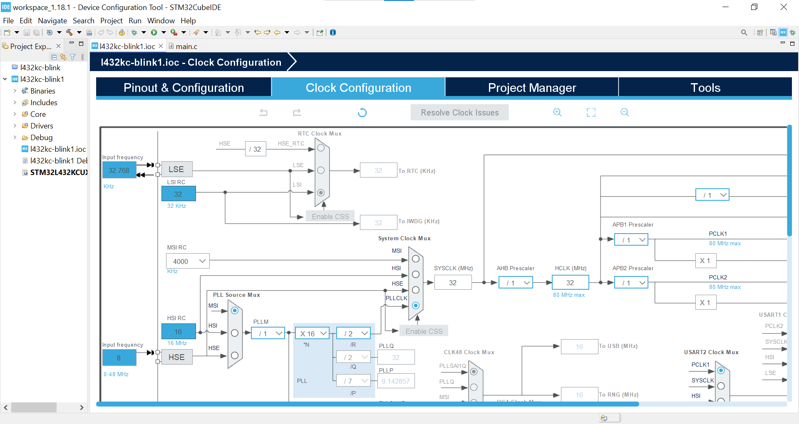
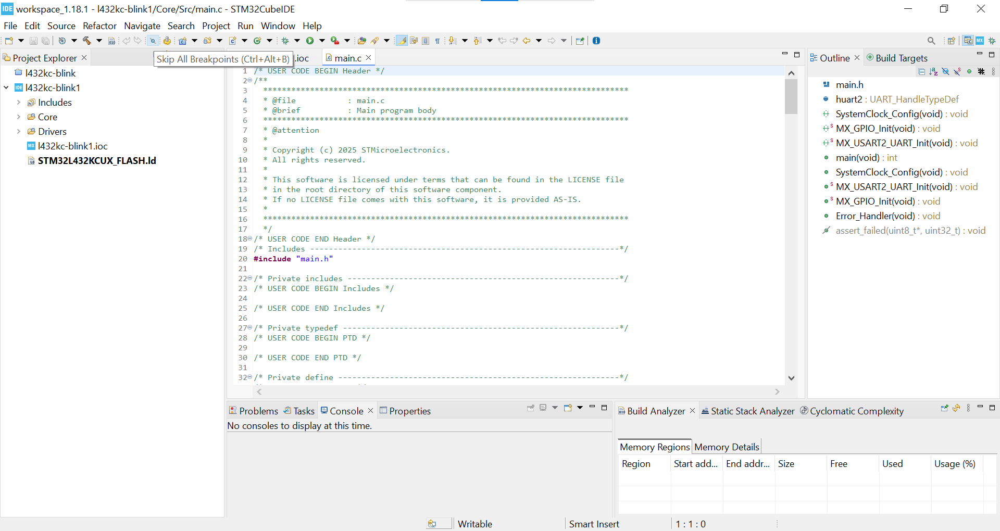
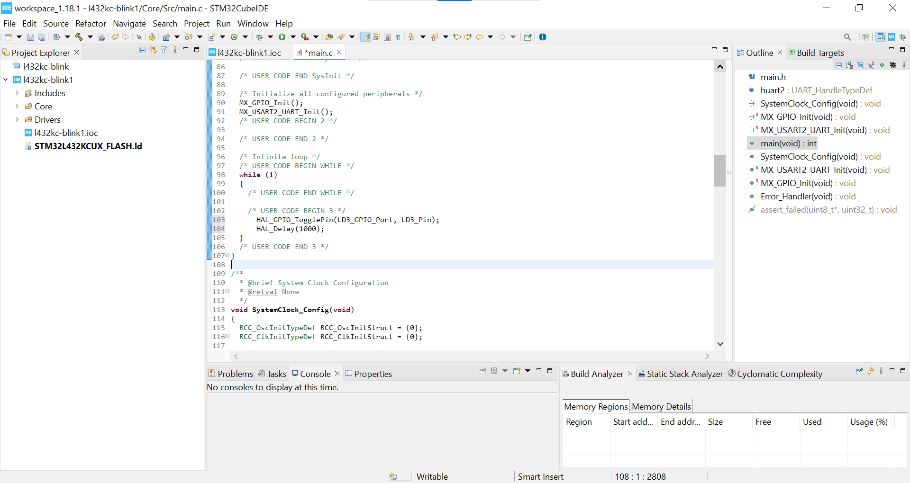

- [1. Welcome](#1-welcome)
- [2. Required Components](#2-required-components)
  - [2.1. Hardware](#21-hardware)
  - [2.2. Software](#22-software)
- [3. STM32CubeIDE Setup](#3-stm32cubeide-setup)

# 1. Welcome
This is a github page for Program Pentauliahan Profesional dalam IoT dan Peranti Papan Pemuka Sesi 2025. This page provides steps in executing blinking LED program in STM32cubeIDE.

# 2. Required Components
## 2.1. Hardware
1. Nucleo-L432KC
2. Micro-USB cable

## 2.2. Software
1. STM32CubeIDE (1.13.0+)

# 3. STM32CubeIDE Setup

1. Open the STM32CubeIDE program.
2. Click **Launch**.
   
3. Navigate to **File > New > STM32 Project**
   

4. Click **Board Selector** then type **"nucleo-l432kc"** in the part number box. Click on the board image and click **Next**.
      

5. A dialog box "STM32 Project" is displayed. Type your project name then click **Finish**.
   

6. Click **Yes**. 
   

7. This is the Input/Output Configuration (IOC) dialog that shows the internal architecture, pinouts and features available for Nucleo-L432KC. 
   

8. Click on the **Clock Configuration** ti shows the clock tree for the Nucleo-L432KC.
   

9. Click on the Yellow Gear icon the generate the source code.

10. This is the main view of the coding.
   

11. Now go to the line 102. Type the following code
    ```
    HAL_GPIO_TogglePin(LD3_GPIO_Port, LD3_Pin);
	HAL_Delay(1000);
    ```

    

12. To power the Nucleo-L432KC, use its CN1 connector to connect in with a computer through a USB Type-A to Mini-B cable.
Click on the project from the project explorer, then right click and select **Build Project**, to compile the project (or click on **Build button** on the toolbar).

13.  Click on the **Build** toolbar icon (hammer), then on the **Debug** button (green bug) to build the project and start the debug session (or in the menu, select **Project > Build Project** then **Run > Debug**).
Click on **Resume** icon (yellow triangle) to continue the execution.
Now watch the green LED (LD2) toggling on the Nucleo-L432KC board.
